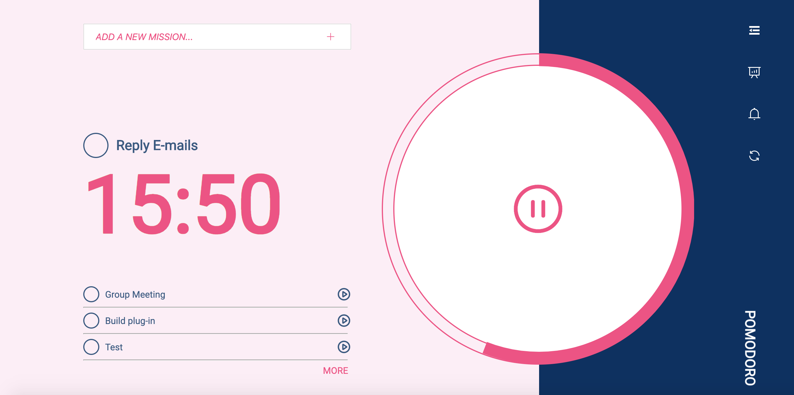

# vue-challenge

[](https://travis-ci.org/dustinhsiao21/vue-challenge)

All Produects are using Vue.js(Vue-cli), TypeScript, ESLint, Travis CI.

## Pomodoro

[See what is Pomodoro here](https://en.wikipedia.org/wiki/Pomodoro_Technique)

demo: [https://dustinhsiao21.github.io/vue-challenge/#/pomodoro](https://dustinhsiao21.github.io/vue-challenge/#/pomodoro)



Feature

- [x] Keep Todo list in localStorage.
- [x] Playing Alarm when working-Break time exchange(only support one sound for demo).
- [x] Showing charts by day and week.

Layout: Element UI


### Usage

#### Project setup
```
npm install
```

#### Compiles and hot-reloads for development
```
npm run serve
```

#### Compiles and minifies for production
```
npm run build
```

#### Run your tests
```
npm run test
```

#### Lints and fixes files
```
npm run lint
```

#### Run your unit tests
```
npm run test:unit
```

### Customize configuration
See [Configuration Reference](https://cli.vuejs.org/config/).
